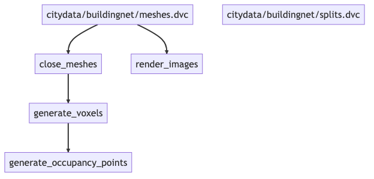
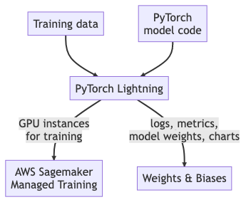
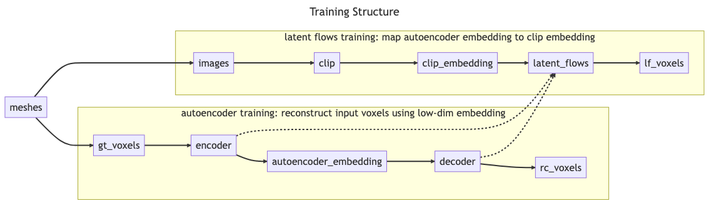
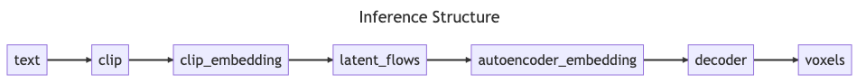

# Text2Building

## Introduction

This repository contains the code for Text2Building, an attempt by myself to
adapt the code for the paper ["CLIP-Forge: Towards Zero Shot Text-to-Shape
Generation"](https://arxiv.org/pdf/2110.02624.pdf) to the domain of 3D building
models.

The goal of this project is to explore using cutting-edge breakthroughs in
generative artficial intellience to democratize the building design process. 

Buildings and cities have become dramatically more complex over the last 150
years. The 2022 revision of the [New York City construction
codes](https://www1.nyc.gov/site/buildings/codes/2022-construction-codes.page),
which just came into effect, has 88 chapters and 34 appendices. 15 chapters
alone refer to plumbing codes. Mandates for increased sustainability add further
complexity. The creation of buildings has [never been more
expensive](https://www.turnerconstruction.com/cost-index), and yet cities need
new construction to become more sustainable and equitable. In the United States
as a whole, the Federal Housing Finance Agency house price index shows that an
average home costs [5.5 times what it did in
1980](https://fred.stlouisfed.org/series/USSTHPI). This is causing a true
affordability crisis.

In tandem with physical complexity, the socio-political problems around
construction within our urban centers have also risen: Some communities have
grown increasingly distrustful of the development process due to a long history
of
[misguided](https://www.urbandisplacement.org/about/what-are-gentrification-and-displacement/)
or
[malevolent](https://www.nytimes.com/2021/08/17/realestate/what-is-redlining.html)
urban development practices. Other communities have economic incentives that are
unaligned with the greater good, and want constricted housing supply so as to
increase their own home prices. Often these groups are wealthy and wield
disproportionate political power. This persists despite a growing body of
research showing that the lack of affordable housing drives many other social
maladies, like rising levels of obesity, falling fertility rates, low
productivity growth, and rising wealth inequality.

Satisfactory answers to this crisis are elusive. Do we demolish historic
neighborhoods to replace them with highrises? Do we sacrifice on sustainable
building practices to make homes cheaper? Do we relax building codes, perhaps
reducing the resiliency and even safety of our new buildings? The answers are
impossible to arrive at axiomatically, and will depend on each community and
situation. This set of indeterminate contrasting forces obstructing any clear
solution to our predicament is known as a Wicked Problem. In the face of Wicked
Problems, an effective solution is iterative design incorporating extensive
feedback from all affected parties. Stakeholders present their ideal visions to
one another and see where the gaps between their visions lie, and then create a
new shared vision that attempts to find a middle ground between their competing
ideals. This process does not succeed after the first attempt, and needs to be
repeated until [sufficient
trust](https://www.nytimes.com/2021/12/02/us/hurricane-sandy-lower-manhattan-nyc.html)
is established and until enough dimensions of the contrasting visions have been
hashed out and resolved. This process is slow, expensive, and time-consuming,
but necessary and important.

Slow, expensive processes are often the first to be cut under time and budgetary
constraints. A clear way that tech can help is by making the process of
designing buildings faster and cheaper. Architects typically charge [around
10%](https://www.architectmagazine.com/practice/an-architects-fees-whats-your-time-worth_o)
of the construction cost for a project, and closer to 12% in NYC. Turnaround
times can be days, weeks, or months, depending on the complexity of the project.
Reducing these costs would allow for cheaper, faster iteration and thus more
iteration. The more attempts stakeholders can have to come to a shared vision,
the more satisfactory the end result is likely to be for all parties.

The hope is that generative algorithms, especially generative AI, can be
leveraged to dramatically reduce these design costs and speed up iteration
cycles. My hope is that these techniques will also help to democratize the
design conversation: If going back to the drawing board after receiving critical
feedback during a community meeting costs only a modicum of time and money, it
may become more possible to deeply consider the needs of all people when
building while still reducing costs.

## Literature Review

The field of 3D generative AI is evolving extremely rapidly. Extensive work is
being done to enable the creation of 3D geometry with a variety of different
input modalities, such as 2D images, incomplete 3D geometry, point clouds,
videos, and text.

I explored recent advancements and challenges in text-to-shape generation,
focusing on zero-shot learning and multimodal approaches. The main paper used in
this review is "CLIP-Forge: Towards Zero-Shot Text-to-Shape Generation," which
proposes a simple yet effective method for zero-shot text-to-shape generation
using an unlabelled shape dataset and a pre-trained image-text network such as
CLIP. This work demonstrates promising zero-shot generalization and provides
extensive comparative evaluations.

Another significant paper is "AutoSDF: Shape Priors for 3D Completion,
Reconstruction, and Generation," which proposes an autoregressive prior for 3D
shapes to solve multimodal 3D tasks such as shape completion, reconstruction,
and generation. The paper presents a non-sequential autoregressive distribution
over a discretized, low-dimensional, symbolic grid-like latent representation of
3D shapes, which allows for the representation of distributions over 3D shapes
conditioned on information from an arbitrary set of spatially anchored query
locations. Although the approach is more complex, it shows potential in
outperforming specialized state-of-the-art methods trained for individual tasks.

"SDFusion: Multimodal 3D Shape Completion, Reconstruction, and Generation"
presents a novel framework built to simplify 3D asset generation for amateur
users by supporting a variety of input modalities, including images, text, and
partially observed shapes. The approach is based on an encoder-decoder,
compressing 3D shapes into a compact latent representation upon which a
diffusion model is learned. The model supports various tasks, outperforming
prior works in shape completion, image-based 3D reconstruction, and text-to-3D,
making it a promising swiss-army-knife tool for shape generation.

Lastly, "Graph Neural Networks in Building Life-Cycle: A Review" examines the
application of graph neural networks (GNNs) in the building lifecycle. The paper
identifies ten application domains from the planning stage to the operation
stage and discusses the challenges and opportunities of GNNs adoption in
architecture, engineering, and construction (AEC). Although the adoption of GNNs
is still in its infancy, the paper highlights the potential for future research.

Additional papers worth considering include "Vitruvio: 3D Building Meshes via
Single-Perspective Sketches," "Zero-Shot Text-Guided Object Generation with
Dream Fields," and "GAUDI: A Neural Architect for Immersive 3D Scene
Generation." These papers further explore text-to-shape generation, zero-shot
learning, and multimodal approaches in the context of 3D building meshes, object
generation, and immersive 3D scene generation, respectively.

## Dataset Creation

I considered several different possible datasets when starting this project. My
first thought was to use one or more of the existing 3D building model datasets
that exist for real-life cities. Such datasets exist for a number of cities,
such as [New York
City](https://github.com/CityOfNewYork/nyc-geo-metadata/blob/master/Metadata/Metadata_3DBuildingModel.md),
[Boston](https://www.bostonplans.org/3d-data-maps/3d-smart-model/about-3d),
[Montreal](https://donnees.montreal.ca/ville-de-montreal/maquette-numerique-plateau-mont-royal-batiments-lod2-avec-textures),
and
[Berlin](https://www.businesslocationcenter.de/en/economic-atlas/download-portal/).
These datasets are compelling because of their vastness. For example, the NYC
datatset for Manhattan alone contains 45,848 3D building models. They are also
compelling because, being derived from real buildings, there is no risk of a
domain gap between our training data and my goal, which is to generate realistic
building models from text.

Ultimately, these datasets proved unsatisfactory, however. These building models
mostly contain 3D models in "LOD 1", meaning that only slightly more detail than
a bounding box for the building is captured. Some of these datasets capture more
roof details, but very few capture geometric facade details. These datasets are
generally intended for low-detail visualization or macro-scale simulation and
analysis, and are not well-suited to architectural visualization.

Another dataset, [BuildingNet](https://buildingnet.org/), ended up being better
aligned to this task. This dataset contains 2,000 human-created, detailed 3D models
of buildings. These models are largely of the style and form that one would
expect for architectural visualization—most seem to have been made in SketchUp
or similar tools.

These 2,000 3D models require extensive normalization and are derived into a
series of other artifacts. The code for this is in [the sibling
repo](https://github.com/maxdumas/text2building_data) for this project. That
repo contains instructions for running and obtaining the data used in this
project.

Normalization steps include:
* Turning each mesh into a watertight mesh using [ManifoldPlus](https://github.com/hjwdzh/ManifoldPlus).
* Removing isolated dangling components from each mesh. This is a heuristic to
  remove components from the meshes that may not correspond to the main building
  mass, such as trees, people, cars, etc.
* Removing the ground plane from each mesh. A number of meshes include some sort
  of floor surface which in some cases is significantly larger than the building
  mesh itself.

Artifact generation steps included:
* Rendering textured, shaded images of each building mesh from 12 different
  evenly spaced angles rotated around the Z-axis.
* Generating 32x32x32 BINVOX voxel representations of each building mesh using
  [`cuda_voxelizer`](https://github.com/maxdumas/cuda_voxelizer).
* Generating 100,000-element occupancy point clouds by sampling points at
  randomly within the bounding box of the voxel volume and checking if they were
  contained by the voxel volume itself.

## Training Infrastructure 
* PyTorch Lightning
* SageMaker Spot Training
* Weights & Biases

Significant effort was spent on adapting the code inherited from the Clip-Forge
project to use current training infrastructure best practices. The main efforts
in this space were the following:

* Adopting [PyTorch Lightning](https://lightning.ai/docs/pytorch/stable/) to
  manage training code. PyTorch Lightning is a Python library designed to
  dramatically reduce the amount of boilerplate code required for most model
  training. It contains built-in functionality for implementing training and
  inference loops and for managing loading training data in batches and in
  different splits. It builds upon this basic boilerplate to enable easy
  generation of CLIs from model parameters, single-switch activation of model
  debugging and training techniques like single-batch overfitting and
  mixed-precision training, among many other features. I chose to adopt PyTorch
  as a way to distill away the non-original parts of the codebase and focus
  purely on the model architecture.
* Enabling the usage of [AWS SageMaker Managed
  Training](https://docs.aws.amazon.com/sagemaker/latest/dg/train-model.html).
  In particular, some effort was spent to enable the usage of [Spot
  Training](https://docs.aws.amazon.com/sagemaker/latest/dg/model-managed-spot-training.html),
  which allows for up to 40% cost savings if your training is adapted to be
  interruptable and resumable. Managed training allows for horizontally scalable
  training, which allowed me to run many experiments concurrently, and to choose
  the best instances for the job so as to minimize spent time waiting for
  training to complete. It also made training a largely push-button process,
  reducing time spent managing instances, babying computers, and worrying about
  crashed or failed training runs.
* Adopting [Weights & Biases](wandb.ai) for experiment management. W&B is a
  cloud platform for tracking all information about ML experiments. By
  outputting all of my metrics and model artifacts to a single location, I was
  able to effectively track model performance in many dimensions across many
  experiments and to be confident that I could always roll back and refer to
  model weights that would correspond to my best performing models. I would also
  know what git commit and hyperparameters produced that model.

## Model Architecture

The model architecture largely mirrors the structure of the CLIP-Forge paper.
Training occurs in two phases: In the first phase, I train an autoencoder to
learn a lower-dimensional representation of 32x32x32 voxel representations of
the 3D building meshes. In the second phase, I generate 2D image renderings of
the 3D building meshes from a variety of angles and compute CLIP embeddings
using those images. I then train a Latent Flows network to map the distribution
of the learned autoencoder embeddings to the distribution of the CLIP
embeddings.

During inference, the input is a text phrase. This text phrase is encoded into
an embedding by CLIP, which can then be brought into the embedding space of the
autoencoder using the Latent Flows network. We then decode the embedding to
arrive at a voxel representation of the text phrase.

The autoencoder differs somewhat from the CLIP-Forge autoencoder in that it is a
variational autoencoder (VAE), whose learned features attempt to model a
high-dimensional gaussian representation of the principal features of the
training data, as opposed to trying to encode the features directly. This type
of autoencoder proved to be more robust in my testing, likely due to a VAE's
ability to generate plausible results when randomly sampled. The final
autoencoder consists of 5 layers of batch-normalized 3D convolutional layers
with rectified linear unit activiation and a final fully-connected layer.

The Latent Flows network remains identical to that used in the CLIP-Forge paper.
This network consists of a sequence of 5 batch-normalized "coupling layers",
which in turn each contain scale and translate networks. The scale networks
consist of 3 fully connected layers interspersed with tanh activation, and the
translation networks consist of 3 fully connected layers interspersed with
rectified linear unit activation.

[CLIP](https://openai.com/research/clip) is a model provided by OpenAI and is
considered frozen for the purposes of this experiment. Its use, as can be
inferred from the above, is to join the text and 2D image modalities into a single
shared embedding space. I am interested in trying out other competing models for
generating joint text-image embeddings in the future.

## Results
* Training loss
* Validation loss
* Diagnosis
    * Latent Flows
    * CLIP embedding performance

## Next Steps

### Additional Data
* RealCity3D
LOD-2 3D models of every building in NYC and Zurich, made easily usable. In particular, the Zurich buildings seem interesting.

* Blackshark.ai
* Cities Skylines dataset
* Objaverse

Recently released by the Allen Institute for AI, the [Objaverse
dataset](https://objaverse.allenai.org/) consists of over 800,000 annotated 3D
models sourced from throughout the Internet. Preliminiary investigation shows
that this dataset includes at least 1,000 models of buildings that are easily
discoverable. The potential of this dataset is significant, as it could easily
double or more the usable data for this experiment. They key issue with this
data is that the included data varies widely in quality, detail, style, and
technique. Some building models are in a cartoon style intended for animation,
others for videogames. Some models may be highly normalized and intended for
usage in CAD software, others may be constructed by photogrammetry of real
buildings and as such have extremely noisy meshes. Figuring out how to properly
normalize these meshes will be key to using them in this project.

* Neural rendering techniques, fantasia, AutoSDF. Fine-tuning emerged foundation models.

* Use CLIP alternatives

[CLIP](https://openai.com/research/clip) is a model provided by OpenAI and is
considered frozen for the purposes of this experiment. Its use, as can be
inferred from the above, is to join the text and 2D image modalities into a single
shared embedding space. I am interested in trying out other competing models for
generating joint text-image embeddings in the future.

* Dive deeper into Latent Flows network architecure